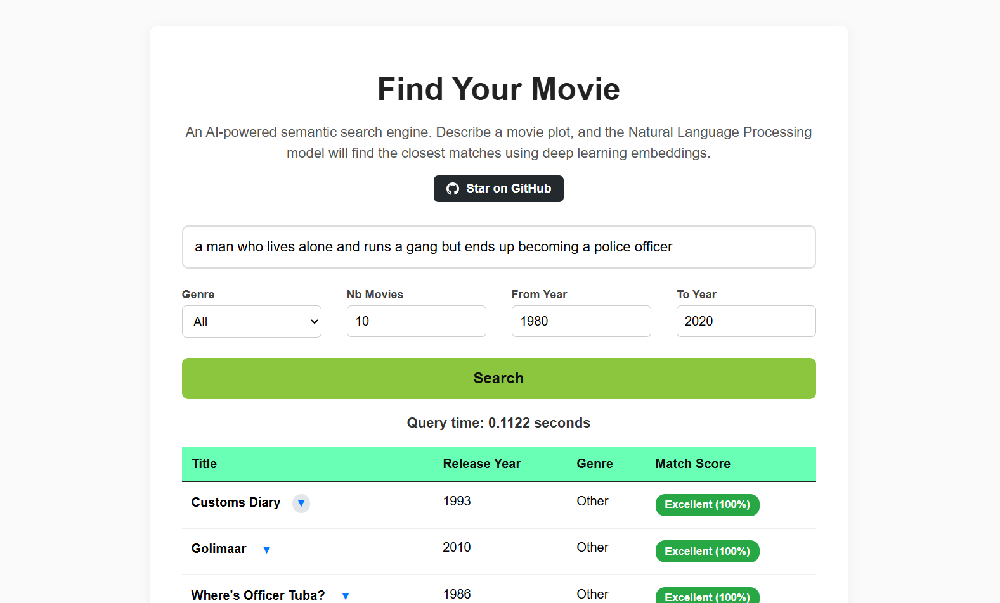
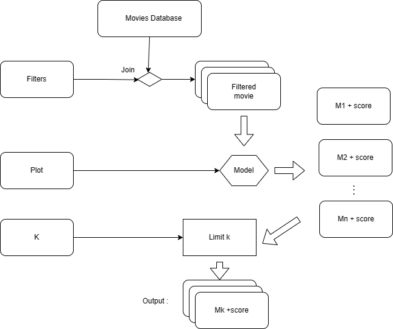

# Semantic Movie Search Engine

An AI-powered search application that uses Natural Language Processing (NLP) to find movies based on plot descriptions, rather than just exact keyword matches.

**Goal:** The primary objective of this project was to practice integrating a large language model (LLM) into a full-stack web application. It served as a hands-on learning test for **System Design**, focusing heavily on optimizing Machine Learning inference pipelines for speed and scalability.

## 🖥️ User Interface

Users can search using a combination of semantic text (understanding the *meaning* of the prompt) and hard metadata filters (Year and Genre). The engine maps the mathematical similarity of the query to the dataset and returns a Match Score.



## ⚙️ System Architecture & Optimization

Initially, the system calculated embeddings on-the-fly. If a user filtered down to 5,000 movies, the application would force the BERT model to process 5,000 text descriptions at runtime. This resulted in execution times exceeding **30 minutes per query**.

Drawing inspiration from Business Intelligence ETL (Extract, Transform, Load) pipelines, I completely refactored the architecture to separate the heavy data processing from the serving layer:



### The Solution: Vector Precomputation

1. **Offline ETL (GPU Accelerated):** I moved the text embedding process to a dedicated script (`src/pipeline.py`) running on a Google Colab GPU. This script passes the entire dataset's plot descriptions through the `sentence-transformers/msmarco-bert-base-dot-v5` model and saves the resulting mathematical vectors as a highly optimized `.npy` file.

2. **Instant Inference:** The Flask web server loads this precomputed NumPy array into RAM at boot.

3. **Optimized Search:** When a user searches, the app only passes the *user's short query* through the model (taking ~50ms). It then uses PyTorch's highly optimized C++ backend to perform a matrix dot-product against the precomputed database.

**Impact:** Execution time dropped from **>30 minutes** to **< 1 second** on a local machine without a GPU, successfully transitioning the system from compute-bound $O(N)$ to near $O(1)$ lookup speeds.

## 🚀 Setup Instructions

Follow these steps to run the application on your local machine.

### 1. Create the Environment

It is highly recommended to use an isolated environment. Make sure you have Anaconda or Miniconda installed.

```bash
# Create a fresh conda environment with Python 3.10
conda create -n sse_env python=3.10 -y

# Activate the environment
conda activate sse_env

# Install all required dependencies
pip install -r requirements.txt
```

### 2. Download Precomputed Data Assets

Due to GitHub's file size limits, the precomputed embeddings and cleaned datasets are hosted externally.

1. Download the data assets from this Google Drive folder: **[[Google Drive Link](https://drive.google.com/drive/folders/1gf-kT0pPjzO9D3MBoT-xkXLTCRJuMoIK?usp=drive_link)]**
2. Ensure you have downloaded both `clean_dataset.csv` and `plot_embeddings.npy`.
3. Place both files inside the `data/preprocessed/` directory at the root of this project.

Your folder structure should look like this:
```text
amir-almamma/
├── data/
│   └── preprocessed/
│       ├── clean_dataset.csv
│       └── plot_embeddings.npy
├── src/
...
```

### 3. Run the Unit Tests

The project includes a suite of Pytest unit tests to ensure the data filtering and machine learning vector math execute correctly.

```bash
# Run tests from the project root
pytest tests/
```

### 4. Launch the Web App

Once the data is in place and tests pass, you can start the server.

```bash
# Start the Flask serving layer
python web/app.py
```

Open your browser and navigate to `http://127.0.0.1:5000` to start searching!