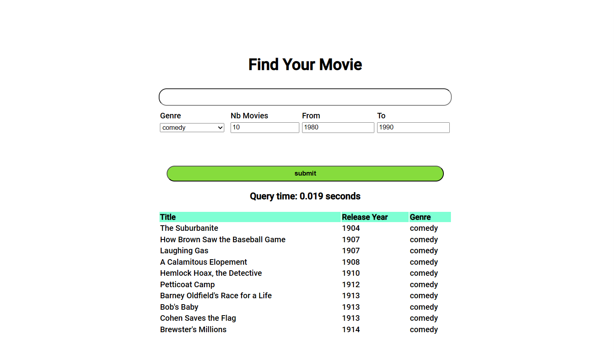

# Movies Search Engine Project

In this file, I will design the approche of takling this problem of making a search engine with filters from a movies dataset. The steps involved in the process are:

 1. Extracting the requirements of the project
 2. Designing the model's pipline
 3. Writing unit tests
 4. ML part: model building
 5. Model Integration
 6. Building the platform
 7. Running the tests
 8. Checking project requirements
 9. Writing documentation
 10. Submitting the project

# Project Requirements

Implement a semantic search engine for movies using pretrained [BERT](https://arxiv.org/pdf/1810.04805.pdf) or [Sentence-BERT](https://arxiv.org/pdf/1908.10084.pdf) for text representation. The desired pipeline should be able to retrieve the top K movies, given the following inputs:

-   K :int (number of movies to suggest, sorted by search score)
-   Plot :str (description of the plot)
-   Genre :str (Optional argument but must be included in the search function)
-   Release year : int
In my implementation of the semantic search engine, I will modify the release year input to an interval, imagine if someone don't know the movie name and only knows that's it's from the 80s. 
So the pipline entries will be start_release_year and end_release_year. Also I will add the release year in the piplines output.
# Making the platform architecture

The model pipline will take in consideration the diffrent filters of the semantic search engine: 

# Writing unit tests

Unit tests will verify diffent senarios of filters inputs on the resulting model, the diffent senarios will include:

 - **test_release_year_order**: the model should be not break if the user entered a wrong release year order (start_release_year > end_release_year)
 -  **Entering empty plot**: the pipline should work in case we give an empty plot or indicate error message
 - **Entering empty Genre**: the pipline should work in case we give an empty Genre or indicate error message
 - **Entering empty k value**: the pipline should work in case we give an empty value of k or indicate error message
 - **Entering negative k value**: the pipline should work in case we give an negative value of k or indicate error message
 - **Entering known plot**: in case we enter the same plot recorded in the dataset for a specific movie M1, the highest matching movie in the output of the model should be M1 (in case the filters are all accurate).

 # ML part: model building
In a notebook, we will choose and test diffrent models with our Dataset: 
##**Model 1:** msmarco-bert-base-dot-v5 from Sentence Bert
In the paper [Sentence-BERT: Sentence Embeddings using Siamese BERT-Networks](https://arxiv.org/pdf/1908.10084.pdf) Nils Reimers and Iryna Gurevych presented Sentence-BERT a modification of BERT pretrained models adpated to derive semantic meaning of sentences.Sentence-BERT is suitable for our task for it's computation time advantage. As a first step I used msmarco-bert-base-dot-v5 model, and tested it's results of a specific movie.
##**Model 2:** Going a step further with Domain Adaptation using Generative Pseudo-Labeling
In the second model, after making a proof of concept model, integrating the model in our project and validating all designed unittest. We will use the gpl from the sbert documentation to adapt our movies semantic search model. Unfortunately performing this task requires alot of computation power and it broke several times when attepting to train it on google colab GPU, the code for performing gpl is in the Notebook.

# Model Integration
In this step, we created a module in our project named models, this module is responsive for loading and using sentence-bert models

# Building the platform
Inorder to test our model innteractively, I build a simple web server using flask with simple interface that enables the user to try diffrent search scenarios, see the Query time (search time) of the model and visualize the results.  
The platform looks like this:

# Running the tests
This Step involved running the tests we made at the start of our project inroder to validate our see module, our see module passed all 6 test scenarios successfully

# Checking project requirements
Our project in the current form respects the requirements given in the readme.md file, it takes in consideration the plot, diffrent filters and output a list of movies from the database in an interactive way

 # Writing documentation
 In the conception of our project we made each module in seperate folder resulting in an intuitive project strucutre, also each block of code is commented, tests and important functions are documented.

# Submitting the project
In the email, it's mentioned that the deadline for submitting the project is for Saturday 17/06/2023 at 23:59. The working branch is feature/amir/sse, it contains the projects code including the tests and the notebook and will be pushed to the remote repository after a final verification. 